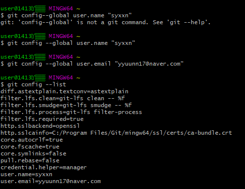
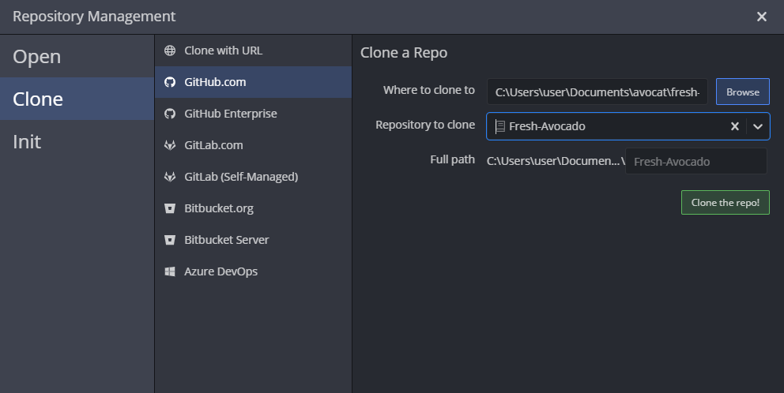

# **GIT**

## 깃이란?

> 컴퓨터 파일의 변경사항을 추적하고 여러 명의 사용자들 간에 해당 파일들의 작업을 조율하기 위한 분산 버전 관리 시스템
>
> -> 여러사람이 공동으로 사용 가능~~(소회의실 느낌)~~

> 깃은 많은 GUI를 지원하는 것이 특징이다. 현재 [소스트리](https://ko.wikipedia.org/wiki/소스트리), GitHub Desktop 등의 여러 GUI를 사용할 수 있다.

 ## GUI란?

+ 그래픽 사용자 인터페이스(**graphical user interface**, **GUI**)는 사용자가 편리하게 사용할 수 있도록 입출력 등의 기능을 알기 쉬운 아이콘 따위의 그래픽으로 나타낸 것


## Git의 특징

* *누가 어떤 코드를 언제 수정했는지 트래킹 할 수 있다*
* *팀 자체의 소스코드를 관리하기 용이하다*
* 내가 올리려는 파일이 누군가 편집한 내용과 충돌한다면, 서버에 업로드 할 때 경고 메세지가 발생됩니다. 

## GIT 저장소 만들기

1. git bash 실행
2. 적당한 경로에 관리할 프로젝트 디렉토리 생성
3. 프로젝트 디렉토리에 "git init" 입력.
4. ".git" 파일이 생성되면 완료.

## GIT에 내 정보 등록하기(1회만 하면 됨)

+ git config --global user.name "(내 닉네임)"

+ git config --global user.email "(내 이메일)"

  위의 두 명령으로 버전에 포함될 버전을 만든 사람에 대한 정보를 설정한다. 이 설정은 ~/gitconfig 파일에 저장된다.

  [git config -- list] 명령어로 git 설정값들을 확인할 수 있음.

<<<<<<< Updated upstream

=======
<<<<<<< Updated upstream

=======
```default

```
> 괄호로 이미 구분해줘서 파일 경로인걸 이미 알고 있음

>>>>>>> Stashed changes


>>>>>>> Stashed changes
