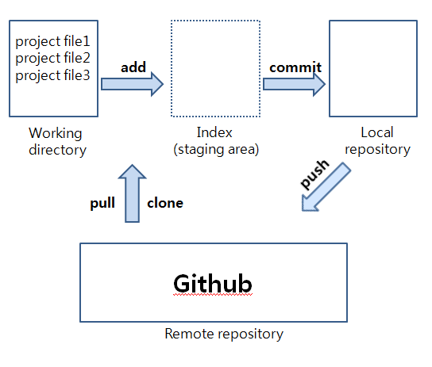

# Git

버전 관리 시스템

장점 : 같은 파일을 여러 명이 동시에 작업하는 병력 개발이 가능하다.

Git : 버전 관리 시스템

Github : 버전 관리 웹호스팅 서비스

GIt GUi - Github Desktop, SourceTree, GitKraken

(데스크탑과 소스트리는 아주,,예전에 써봤고 깃크라켄은 아보켓에서 써보는중)

## 맨날 하는거

git init

git add .

git commit -m "message"

git push

처음엔 (git remote add origin 주소)

*추가



working directory - 현재 작업하고 있는 공간.

git이 관리하고 있지만 아직 추적하지 않음

index - 준비 공간. git이 추척하고 있으며 버전으로 등록되기 전.

repository - 저장소. 자신의 PC에 존재하는 로컬 repository, 원격 저장소인 remote repository가 있다.

### 기초 용어

git init - 이니셜라이즈로 .git파일을 만든다.

git branch - 새로 만든 branch lab1은 master와 동일한 상태를 가진다. 브랜치에서 수정하고 커밋하면 lab1에만 기록되고 master 브랜치에는 영향이 없다.

checkout - 브랜치를 자유롭게 이동한다.

commit - 커밋

status - 상태

clone - 클론. 깃허브에서 zip 파일로 받으면 .git 폴더는 없다.

pull - 리모트 저장소의 변경된 내용을 로컬(내 컴퓨터) 저장소에 적용하는 작업. 원격 저장소의 변경 내용이 로컬 작업 디렉토리에 받아지고(fetch), 병합(merge)된다.

master - 기본 가지

git merge (가지) - 다른 가지의 변경 내용을 현재 가지에 병합하려고 할 때 씀. 만약 두 브랜치가 같은 파일의 같은 곳을 수정했다면 충돌이 발생함.


git checkout -b feature_x - "feature_x"라는 이름의 가지 만듦

git checkout master - master 가지로 돌아옴

git branch -d feature_x - delete를 함.

git push origin (가지) - 원격 저장소로 전송하기 전까지 남의 접근 불가

git diff (원래 가지) (비교 대상 가지) - 변경 내용 병합 전에 바뀐 내용 비교 가능.

git checkout -- (파일 이름) - 변경 전 상태로 돌아감.

git reset - 특정 커밋으로 되돌아갈 수 있으나, 되돌린 버전 이후의 버전들은 히스토리에서 삭제.

git revert - 특정 버전으로 되돌아갈 수 있으나, 되돌린 버전 이후의 버전들의 이력이 남아있다.


.git ignore

(써야지 하는데 맨날 안써서 private에 방치됨)

*

.gitignore 파일에 작성한 파일이 이미 버전관리가 되고 있으면 깃은 원래대로 추적하니 수동으로 삭제해야함.

git rm --cached 파일명

git rm --cached 폴더명\ -r

```
# CocoaPods
# We recommend against adding the Pods directory to your .gitignore. However
# you should judge for yourself, the pros and cons are mentioned at:
# https://guides.cocoapods.org/using/using-cocoapods.html#should-i-check-the-pods-directory-into-source-control
# Pods/
# Add this line if you want to avoid checking in source code from the Xcode workspace
# *.xcworkspace
```

https://www.toptal.com/developers/gitignore

여기에 swift 치니까 이렇게 나온다.


느낀점 : 깃허브는 혼자 개발할때보다 협업할 때 써야하고 그리고 이론보다는 실전으로 배우는게 좋을 거 같다 ^.^ 브랜치 머지 풀 다 써봅시당